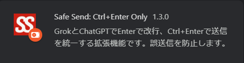

# Safe Send: Ctrl+Enter Only  

GrokとChatGPTで  
Enter = 改行  
Ctrl+Enter = 送信  
を統一。誤送信を防ぐブラウザ拡張機能です。  

---

## 機能 💡
- Enterキー：テキスト入力エリアで改行を挿入  
- Ctrl+Enter：メッセージを送信  

---

## インストール方法 📦
1. このリポジトリをクローンまたはダウンロード  
2. Chrome拡張機能が使えるブラウザの管理画面を開く  
3. 右上の「デベロッパーモード」をON  
4. 「パッケージ化されていない拡張機能を読み込む」で本フォルダを選択  
5. Grok や ChatGPT を開いて体験してください！ 🎉  

**※ 対応サイトの拡張について**  
`manifest.json` の `matches` を追加して対応サイトを広げられますが、  
サイト実装の違いにより調整が必要になる場合があります。

---

## 使い方 📝
拡張機能を導入し有効にするだけで、特別な設定は不要です。  

---

## スクリーンショット 📷
  

---

## コントリビュート 💪
- バグ報告などは [Issues] へお願いします。  

---

## プライバシー  
- データ収集・外部送信なし／追加権限なし  

---

## ライセンス 📜
MIT License  
詳しくは [LICENSE] ファイルを参照してください。  
自由に使って、シェアしてもらえたら嬉しいです！  
